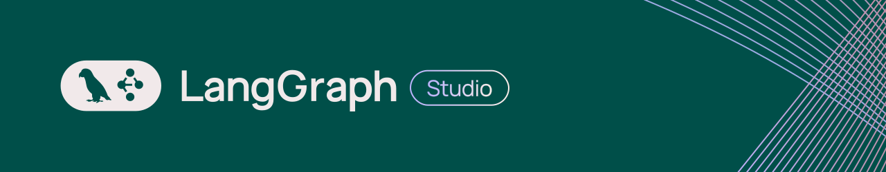
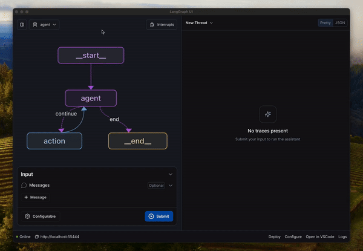

# LangGraph Studio Desktop (Deprecated)

LangGraph Studio offers a new way to develop LLM applications by providing a specialized agent IDE that enables visualization, interaction, and debugging of complex agentic applications

With visual graphs and the ability to edit state, you can better understand agent workflows and iterate faster. LangGraph Studio integrates with [LangSmith](https://smith.langchain.com/) so you can collaborate with teammates to debug failure modes.

While in Beta, LangGraph Studio is available for free to all LangSmith users on any plan tier. [Sign up for LangSmith here](http://smith.langchain.com/).

> [!NOTE]
> We recommend that users [run a local LangGraph server and use the web version of LangGraph Studio](https://langchain-ai.github.io/langgraph/tutorials/langgraph-platform/local-server/) instead of using the LangGraph Studio Desktop application. This is a newer feature that improves the development experience, as it works without Docker, significantly shortens startup times, supports code hot-reloading, and works across all platforms.



## Download

Download the latest `.dmg` file of LangGraph Studio by clicking [here](https://langgraph-studio.vercel.app/api/mac/latest) or by visiting the [releases page](https://github.com/langchain-ai/langgraph-studio/releases).

The desktop application only supports macOS. Other users can [run a local LangGraph server and use the web studio](https://langchain-ai.github.io/langgraph/tutorials/langgraph-platform/local-server/#langgraph-studio-web-ui). We also depend on Docker Engine to be running, currently we only support the following runtimes:

- [Docker Desktop](https://docs.docker.com/engine/install/)
- [Orbstack](https://orbstack.dev/)

## Setup

LangGraph Studio requires docker-compose version 2.22.0+ or higher. Please make sure you have [Docker Desktop](https://docs.docker.com/engine/install/) or [Orbstack](https://orbstack.dev/) installed and running before continuing.

To use LangGraph Studio, make sure you have a [project with a LangGraph app](https://langchain-ai.github.io/langgraph/cloud/deployment/setup/) set up.

For this example, we will use this example repository [here](https://github.com/langchain-ai/langgraph-example) which uses a `requirements.txt` file for dependencies:

```shell
git clone https://github.com/langchain-ai/langgraph-example.git
```

If you would like to use a `pyproject.toml` file instead for managing dependencies, you can use [this](https://github.com/langchain-ai/langgraph-example-pyproject) example repository.

```shell
git clone https://github.com/langchain-ai/langgraph-example-pyproject.git
```

You will then want to create a `.env` file with the relevant environment variables:

```shell
cp .env.example .env
```

You should then open up the `.env` file and fill in with relevant OpenAI, Anthropic, and [Tavily](https://app.tavily.com/sign-in) API keys.

If you already have them set in your environment, you can save them to this .env file with the following commands:

```shell
echo "OPENAI_API_KEY=\"$OPENAI_API_KEY\"" > .env
echo "ANTHROPIC_API_KEY=\"$ANTHROPIC_API_KEY\"" >> .env
echo "TAVILY_API_KEY=\"$TAVILY_API_KEY\"" >> .env
```

**Note: do NOT add a LANGSMITH_API_KEY to the .env file.** We will do this automatically for you when you authenticate, and manually setting this may cause errors.

Once you've set up the project, you can use it in LangGraph Studio. Let's dive in!

## Open a project

When you open LangGraph Studio desktop app for the first time, you need to login via LangSmith.


Once you have successfully authenticated, you can choose the LangGraph application folder to use — you can either drag and drop or manually select it in the file picker. If you are using the example project, the folder would be `langgraph-example`.

> [!IMPORTANT]
> The application directory you select needs to contain correctly configured `langgraph.json` file. See more information on how to configure it [here](https://langchain-ai.github.io/langgraph/cloud/reference/cli/#configuration-file) and how to set up a LangGraph app [here](https://langchain-ai.github.io/langgraph/cloud/deployment/setup/).


Once you select a valid project, LangGraph Studio will start a LangGraph API server and you should see a UI with your graph rendered.


## Invoke graph

Now we can run the graph! LangGraph Studio lets you run your graph with different inputs and configurations.

### Start a new run

To start a new run:

1. In the dropdown menu (top-left corner of the left-hand pane), select a graph. In our example the graph is called `agent`. The list of graphs corresponds to the `graphs` keys in your `langgraph.json` configuration.
1. In the bottom of the left-hand pane, edit the `Input` section.
1. Click `Submit` to invoke the selected graph.
1. View output of the invocation in the right-hand pane.

The following video shows how to start a new run:

https://github.com/user-attachments/assets/e0e7487e-17e2-4194-a4ad-85b346c2f1c4

### Configure graph run

To change configuration for a given graph run, press `Configurable` button in the `Input` section. Then click `Submit` to invoke the graph.

> [!IMPORTANT]
> In order for the `Configurable` menu to be visible, make sure to specify config schema when creating `StateGraph`. You can read more about how to add config schema to your graph [here](https://langchain-ai.github.io/langgraph/how-tos/configuration/#configure-the-graph).

The following video shows how to edit configuration and start a new run:

https://github.com/user-attachments/assets/8495b476-7e33-42d4-85cb-2f9269bea20c

## Create and edit threads

### Create a thread

When you open LangGraph Studio, you will automatically be in a new thread window. If you have an existing thread open, follow these steps to create a new thread:

1. In the top-right corner of the right-hand pane, press `+` to open a new thread menu.

The following video shows how to create a thread:

https://github.com/user-attachments/assets/78d4a692-2042-48e2-a7e2-5a7ca3d5a611

### Select a thread

To select a thread:

1. Click on `New Thread` / `Thread <thread-id>` label at the top of the right-hand pane to open a thread list dropdown.
1. Select a thread that you wish to view / edit.

The following video shows how to select a thread:

https://github.com/user-attachments/assets/5f0dbd63-fa59-4496-8d8e-4fb8d0eab893

### Edit thread state

LangGraph Studio allows you to edit the thread state and fork the threads to create alternative graph execution with the updated state. To do it:

1. Select a thread you wish to edit.
1. In the right-hand pane hover over the step you wish to edit and click on "pencil" icon to edit.
1. Make your edits.
1. Click `Fork` to update the state and create a new graph execution with the updated state.

The following video shows how to edit a thread in the studio:

https://github.com/user-attachments/assets/47f887e7-2e3f-46ce-977c-f474c3cd797e

## How to add interrupts to your graph

You might want to execute your graph step by step, or stop graph execution before/after a specific node executes. You can do so by adding interrupts. Interrupts can be set for all nodes (i.e. walk through the agent execution step by step) or for specific nodes. An interrupt in LangGraph Studio means that the graph execution will be interrupted both before and after a given node runs.

### Add interrupts to a list of nodes

To walk through the agent execution step by step, you can add interrupts to a all or a subset of nodes in the graph:

1. In the dropdown menu (top-right corner of the left-hand pane), click `Interrupt`.
2. Select a subset of nodes to interrupt on, or click `Interrupt on all`.

The following video shows how to add interrupts to all nodes:

https://github.com/user-attachments/assets/db44ebda-4d6e-482d-9ac8-ea8f5f0148ea

### Add interrupt to a specific node

1. Navigate to the left-hand pane with the graph visualization.
1. Hover over a node you want to add an interrupt to. You should see a `+` button show up on the left side of the node.
1. Click `+` to invoke the selected graph.
1. Run the graph by adding `Input` / configuration and clicking `Submit`

The following video shows how to add interrupts to a specific node:

https://github.com/user-attachments/assets/13429609-18fc-4f21-9cb9-4e0daeea62c4

To remove the interrupt, simply follow the same step and press `x` button on the left side of the node.

## Human-in-the-loop

In addition to interrupting on a node and editing the graph state, you might want to support human-in-the-loop workflows with the ability to manually update state. Here is a modified version of `agent.py` with `agent` and `human` nodes, where the graph execution will be interrupted on `human` node. This will let you send input as part of the `human` node. This can be useful when you want the agent to get user input. This essentially replaces how you might use `input()` if you were running this from the command line.

```python
from typing import Literal

from langchain_openai import ChatOpenAI
from langgraph.graph import MessagesState, StateGraph, END
from langgraph.types import Command, interrupt


model = ChatOpenAI(temperature=0, model_name="gpt-4o")


def call_model(state: MessagesState) -> Command[Literal["human", END]]:
    messages = state["messages"]
    response = model.invoke(messages)

    return Command(
        goto="human",
        update={"messages": [response]},
    )


def human_feedback(state: MessagesState) -> Command[Literal["agent"]]:
    """A node for collecting user input."""
    print("Waiting for user input...")
    user_input = interrupt(value="Ready for user input.")

    print("user input:", user_input)

    return Command(
        goto="agent",
        update={
            "messages": [
                {
                    "role": "human",
                    "content": user_input,
                }
            ]
        },
    )


workflow = StateGraph(MessagesState)
workflow.set_entry_point("agent")
workflow.add_node("agent", call_model)
workflow.add_node("human", human_feedback)

graph = workflow.compile()
```

The following video shows how to manually send state updates (i.e. messages in our example) when interrupted:

https://github.com/user-attachments/assets/f6d4fd18-df4d-45b7-8b1b-ad8506d08abd

## Edit project config

LangGraph Studio allows you to modify your project config (`langgraph.json`) interactively.

To modify the config from the studio, follow these steps:

1. Click `Configure` on the bottom right. This will open an interactive config menu with the values that correspond to the existing `langgraph.json`.
1. Make your edits.
1. Click `Save and Restart` to reload the LangGraph API server with the updated config.

The following video shows how to edit project config from the studio:

https://github.com/user-attachments/assets/86d7d1f7-800c-4739-80bc-8122b4728817

## Edit graph code

With LangGraph Studio you can modify your graph code and sync the changes live to the interactive graph.

To modify your graph from the studio, follow these steps:

1. Click `Open in VS Code` on the bottom right. This will open the project that is currently opened in LangGraph studio.
1. Make changes to the `.py` files where the compiled graph is defined or associated dependencies.
1. LangGraph studio will automatically reload once the changes are saved in the project directory.

The following video shows how to open code editor from the studio:

https://github.com/user-attachments/assets/8ac0443d-460b-438e-a379-182ec9f68ff5

After you modify the underlying code you can also replay a node in the graph. For example, if an agent responds poorly, you can update the agent node implementation in your code editor and rerun it. This can make it much easier to iterate on long-running agents.

https://github.com/user-attachments/assets/9ec1b8ed-c6f8-433d-8bef-0dbda58a1075

## Troubleshooting

### How do I access local services and models such as Ollama, Chroma, etc?

LangGraph Studio relies on Docker Compose to run the API, Redis and Postgres, which in turn creates its own network. Thus, to access local services you need to use `host.docker.internal` as the hostname instead of `localhost`. See [#112](https://github.com/langchain-ai/langgraph-studio/issues/112) for more details.

### Failing to install native dependencies during build

By default, we try to make the image as small as possible, thus some dependencies such as `gcc` or `build-essentials` are missing from the base image. If you need to install additional dependencies, you can do so by adding additional Dockerfile instructions in the `dockerfile_lines` section of your `langgraph.json` file:

```
{
    "dockerfile_lines": [
        "RUN apt-get update && apt-get install -y gcc"
    ]
}
```

See [How to customize Dockerfile](https://langchain-ai.github.io/langgraph/cloud/deployment/custom_docker) for more details.
